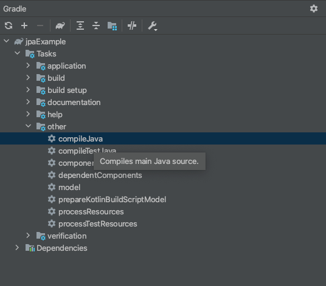

# Getting Started

complieJava 를 실행후 스프링부트 시작.

# 로컬 docker mysql, redis 구동

<strong>로컬 mysql 과 로컬 redis 를 사용하지 않는다면 아래 설정을 하지 않아도 됩니다.</strong>
<strong>application.yml 에서 mysql, redis 정보를 개발환경에 맞게 수정해 주세요</strong>

## 사전조건

docker 설치

### docker 프로세스 확인

~~~
docker ps
~~~

### docker mysql 구동

- 시작

~~~
docker start local-docker-mysql
~~~

- 종료

~~~
docker stop local-docker-mysql
~~~

### docker redis

- 시작

~~~
docker start local_docker_redis
~~~

- 종료

~~~
docker stop local_docker_redis
~~~

### docker 전체

docker-compose.yml 에 정의 되어 있음

- 시작

~~~
docker-compose up -d
~~~

- 종료

~~~
docker stop $(docker ps -q)
~~~

### Reference Documentation

For further reference, please consider the following sections:

* [Official Gradle documentation](https://docs.gradle.org)
* [Spring Boot Gradle Plugin Reference Guide](https://docs.spring.io/spring-boot/docs/2.4.5/gradle-plugin/reference/html/)
* [Create an OCI image](https://docs.spring.io/spring-boot/docs/2.4.5/gradle-plugin/reference/html/#build-image)
* [Spring Web](https://docs.spring.io/spring-boot/docs/2.4.5/reference/htmlsingle/#boot-features-developing-web-applications)
* [Spring Data JPA](https://docs.spring.io/spring-boot/docs/2.4.5/reference/htmlsingle/#boot-features-jpa-and-spring-data)

### Guides

The following guides illustrate how to use some features concretely:

* [Building a RESTful Web Service](https://spring.io/guides/gs/rest-service/)
* [Serving Web Content with Spring MVC](https://spring.io/guides/gs/serving-web-content/)
* [Building REST services with Spring](https://spring.io/guides/tutorials/bookmarks/)
* [Accessing Data with JPA](https://spring.io/guides/gs/accessing-data-jpa/)
* [Accessing data with MySQL](https://spring.io/guides/gs/accessing-data-mysql/)

### Additional Links

These additional references should also help you:

* [Gradle Build Scans – insights for your project's build](https://scans.gradle.com#gradle)

